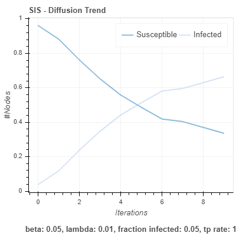
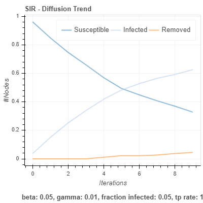
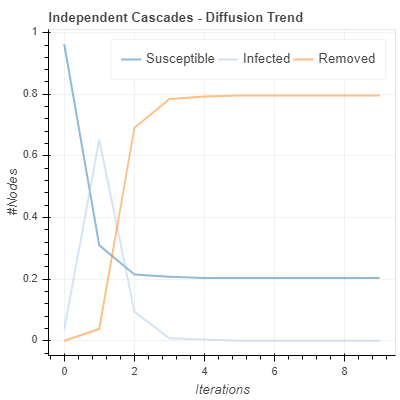
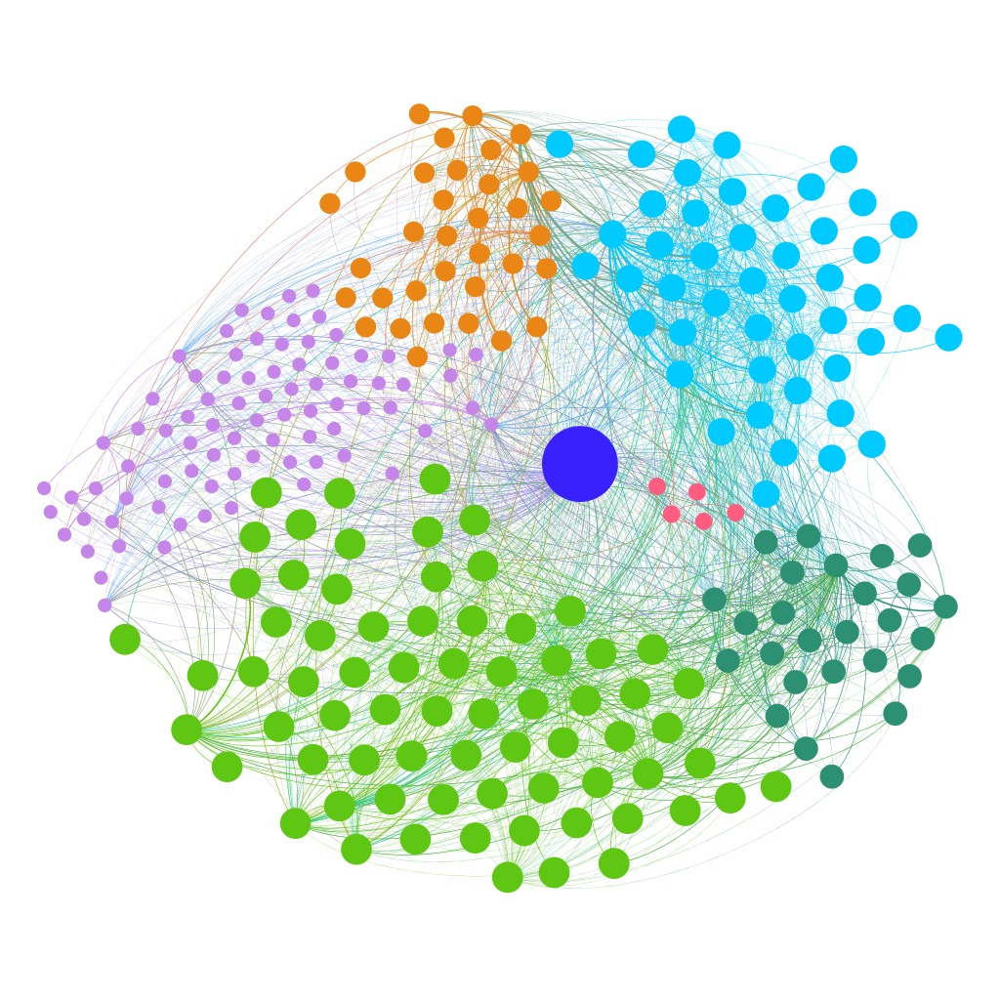

# Analyzing-Information-diffusion-in-Ego-centric-Twitter-Network

It is a tool to analyze the flow of information in any ego centric network by focusing around the key individuals of the network.

For this project the ego network is generated for the actress *Rakulpreet* from her twitter handle [@Rakulpreet](https://twitter.com/Rakulpreet?ref_src=twsrc%5Egoogle%7Ctwcamp%5Eserp%7Ctwgr%5Eauthor).

## Libraries Used
1. Pandas
2. Tweepy
3. NetworkX
4. Ndlib
5. Matplotlib

## Algorithms Used
1. Centrality
* [Degree Centrality](https://link.springer.com/article/10.1007/s13278-018-0493-2)
* [Betweenness Centrality](https://link.springer.com/article/10.1007/s13278-018-0493-2)
* [Eigenvector centrality](https://link.springer.com/article/10.1007/s13278-018-0493-2)

2. Diffusion Analysis
* [Susceptible-Infected-Susceptible(SIS) Model](https://ndlib.readthedocs.io/en/latest/reference/models/epidemics/SIS.html)
* [Susceptible-Infected-Removed(SIR) Model](https://ndlib.readthedocs.io/en/latest/reference/models/epidemics/SIR.html)
* [Independent Casscading(IC) Model](https://ndlib.readthedocs.io/en/latest/reference/models/epidemics/IndependentCascades.html)

3. Community Detection
* [Louvian Algorithm](https://towardsdatascience.com/louvain-algorithm-93fde589f58c)

## Gallery

## License
This project is MIT licensed.

Copyright (C) 2020 Ankit Kumar
